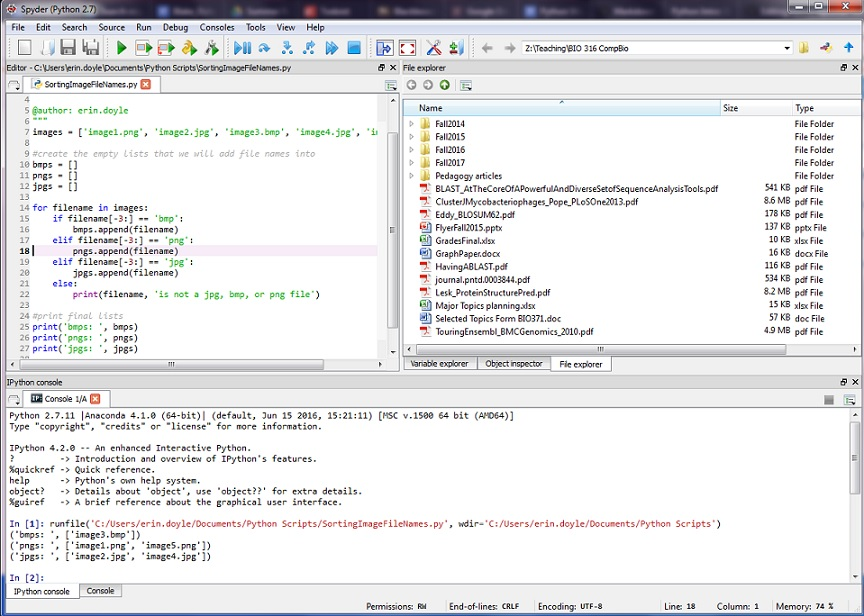

## Introduction to Python and the Spyder environment

Spyder is an Integrated Development Environment (IDE) used for writing/developing code.  Technically, you could write your code 
using any old text editor (for example, nano, that we will use in the Unix shell lessons).  However, an IDE like Spyder has some nice features that will make it easier to see the structure of your code, track variables, and find obvious errors/bugs.

> ## Word Processors vs Text Editors
> You DO NOT want to write your code in a word processing program like Microsoft Office.  This will introduce formatting and
> other features that Python will not be able to deal with.  Stick to Spyder or a plain text editor (saves to a .txt format)!  
{: .callout}

### Starting Spyder

In the DIVAs VM, we will start Spyder from the command line.

Open a command terminal and type the command ```spyder``` and then hit enter.
This will start the Spyder application.  Note: depending on your settings, this may take a while.

> ## Using Spyder and the command line
> If you start Spyder in your command line as described above, your command line terminal will be occupied by Spyder and you 
> will not be able to use it to run other commands or processes.  You will need to start a second terminal to do other things.
> 
> If you want to start Spyder and leave that command line terminal available, use the command ```spyder &```.
{: .callout}

### Useful Spyder Features

The following Spyder features/tabs/windows will be the most useful to you.  You will want to set up your Spyder screen so that 
you can easily access them.

* The console: This is where we can write and run code one line at a time.  If you are running a script in the Editor window of 
Spyder, this is also where any output or error messages will appear.  IMPORTANT: Code written here will not be saved.
* The editor window: This is where we can write and save longer pieces of code that include multiple lines/commands.  This is 
where we will eventually be writing most of our code.
* File and Variable Explorers: Can be used for exploring the folder you are working in, and for understanding the behavior of your 
code (debugging).
* The Working Directory is where Spyder will save your scripts and look for files.  You can change your working directory by 
using the buttons at the top-left of Spyder.  It is a good idea to create one folder that you can easily find to store all of 
your Python projects.   On the DIVAS VM, your working directory is automatically set to <Path>. We will reset this to be 
home/Desktop/workshops/<your_directory>
  



