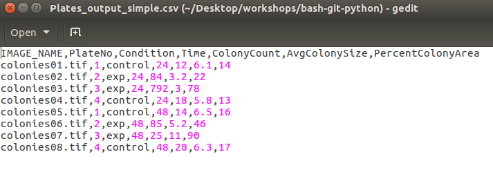
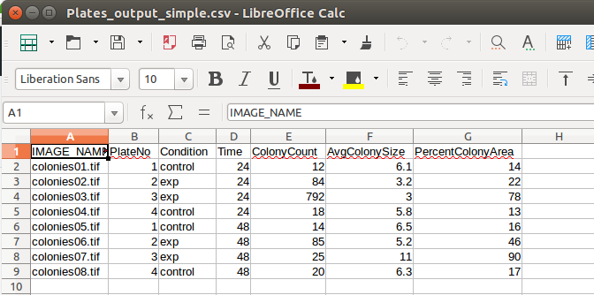

## Why do we want to read and write files?
Being able to open and read in files allows us to work with larger data sets, where it wouldn’t be possible to type in each and 
every value and store them one-at-a-time as variables.  Writing files allows us to process our data and then save the output to 
a file so we can look at it later.

Right now, we will practice working with a comma-delimited text file (.csv) that contains several columns of data.  However, 
what you learn in this lesson can be applied to any general text file.  In the [next lesson]({{ page.root }}/09-numpy), you will 
learn another way to read and process .csv data.

## Paths to files
In order to open a file, we need to tell Python exactly where the file is located, relative to where Python is currently 
working (the working directory).  In Spyder, we can do this by setting our current working directory to the folder where the
file is located.  Or, when we provide the file name, we can give a complete path to the file.

> ## Lesson Setup
> We will work with the practice file **Plates_output_simple.csv**.
> 1. Locate the file *Plates_output_simple.csv* in the directory **home/Desktop/workshops/bash-git-python**.
> 2. Copy the file to your working directory, **home/Desktop/workshops/YourName**.
> 3. Make sure that your working directory is also set to the folder home/Desktop/workshops/YourName.
> 4. As you are working, make sure that you save your file opening script(s) to this directory.
{: .callout}  

### The File Setup
Let's open and examine the structure of the file Plates_output_simple.csv.  If you open the file in a text editor, you will see
that the file contains several lines of text.  

However, this is fairly difficult to read.  If you open the file in a spreadsheet program such as LibreOfficeCalc or Excel, you 
can see that the file is organized into columns, with each column separated by the commas in the image above (hence the file 
extension **.csv**, which stands for comma-separated values).

The file contains one header row, followed by eight rows of data.  Each row represents a single plate image.  If we look at the 
column headings, we can see that we have collected data for each plate:
* The name of the image from which the data was collected
* The plate number (there were 4 plates, with each plate imaged at two different time points)
* The growth condition (either control or experimental)
* The observation timepoint (either 24 or 48 hours)
* Colony count for the plate
* The average colony size for the plate
* The percentage of the plate covered by bacterial colonies

We will read in this data file and then work to analyze the data.

### Opening and reading files is a three-step process
We will open and read the file in three steps.
1. We will create a variable to hold the name of the file that we want to open.  
2. We will call a open to open the file.  
3. We will call a function to actually read the data in the file and store it in a variable so that we can process it. 

And then, there's one more step to do!

* When we are done, we should remember to close the file!

You can think of these three steps as being similar to checking out a book from the library.  First, you have to go to the 
catalog or database to find out which book you need (the filename).  Then, you have to go and get it off the shelf and open the 
book up (the *open* function).  Finally, to gain any information from the book, you have to read the words (the *read* 
function)!

Here is an example of opening, reading, and closing a file.
~~~
#Create a variable for the file name
filename = 'Plates_output_simple.csv' #This is simply a string of text

#Open the file
infile = open(filename, 'r') # 'r' tells Python we are opening the file to read it, infile is the opened file object that we will be able to read

#Store the data from the file in a variable
data = infile.read()

#Print the data in the file
print(data)

#close the file
infile.close()
~~~
{: .language-python}
Once we have read the data in the file into our variable *data*, we can treat it like any other variable in our code.

> ## Use consistent names to make your code clearer
> It is a good idea to develop some consistent habits about the way you open and read files.  Using the same (or similar!) 
> variable names each time will make it easier for you to keep track of which variable is the name of the file, which variable 
> is the opened file object, and which variable contains the read-in data.
>
> In these examples, we will use `filename` for the text string containing the file name, `infile` for the open file object from 
> which we can read in data, and `data` for the variable holding the contents of the file.
{: .callout}

### Commands for reading in files 
There are a variety of commands that allow us to read in data from files.    
`infile.read()` will read in the entire file as a single string of text.  
`infile.readline()` will read in one line at a time (each time you call this command, it reads in the next line).    
`infile.readlines()` will read all of the lines into a list, where each line of the file is an item in the list.  

Mixing these commands can have some unexpected results.
~~~
#Create a variable for the file name
filename = 'Plates_output_simple.csv'

#Open the file
infile = open(filename, 'r') 

#Print the first two lines of the file
print(infile.readline())
print(infile.readline())

#call infile.read()
print(infile.read())

#close the file
infile.close()
~~~
{: .language-python}

Notice that  the `infile.read()`command started at the third line of the file, where the first two `infile.readline()` commands 
left off.  

Think of it like this: when the file is opened, a pointer is placed at the top left corner of the file at the beginning of the 
first line.  Any time a *read* function is called, the cursor or pointer advances from where it already is.  The first 
`infile.readline()` started at the beginning of the file and advanced to the end of the first line.  Now, the pointer is 
positioned at the beginning of the second line.  The second `infile.readline()` advanced to the end of the second line of the 
file, and left the pointer positioned at the beginning of the third line. `infile.read()` began from this 
position, and advanced through to the end of the file.

In general, if you want to switch between the different kinds of *read* commands, you should close the file and then open it 
again to start over.

### Reading all of the lines of a file into a list
`infile.readlines()` will read all of the lines into a list, where each line of the file is an item in the list.  This is 
extremely useful, because once we have read the file in this way, we can loop through each line of the file and process it.
This approach works well on data files where the data is organized into columns similar to a spreadsheet, because it is likely
that we will want to handle each line in the same way.

The example below demonstrates this approach:
~~~
#Create a variable for the file name
filename = "Plates_output_simple.csv"

#Open the file
infile = open(filename, 'r') 

lines = infile.readlines() 

for line in lines: #lines is a list with each item representing a line of the file
	if 'control' in line:
		print(line) #print lines for control condition

infile.close() #close the file when you're done!
~~~
{: .language-python}

### Using `.split()` to separate "columns"
Since our data is in a .csv file, we can use the `split` command to separate each line of the file into a list.  This can be 
useful if we want to access specific columns of the file.  

~~~
#Create a variable for the file name  
filename = "Plates_output_simple.csv"

#Open the file
infile = open(filename, 'r') 

lines = infile.readlines() 

for line in lines:
	sline = line.split(',')  # separates line into a list of items.  ',' tells it to split the lines at the commas
	print(sline) #each line is now a list

infile.close()  #Always close the file!
~~~
{: .language-python}

> ## Consistent names, again
> At first glance, the variable name `sline` in the example above may not make much sense.  In fact, we chose it to be an 
> abbreviation for "split line", which exactly describes the contents of the variable.
> 
> You don't have to use this naming convention if you don't want to, but you should work to use consistent variable names 
> across your code for common operations like this.  It will make it much easier to open an old script and quickly understand
> exactly what it is doing.
{: .callout}
  
> ## Converting text to numbers
> When we called the `readlines()` command in the previous code, Python reads in the contents of the file as a string.  If we 
> want our code to recognize something in the file as a number, we need to tell it this!  
> 
> For example, `float('5.0')` will tell Python to treat the text string '5.0' as the number 5.0.  `int(sline[4])` will tell 
> our code to treat the text string stored in the 5th position of the list *sline* as an integer (non-decimal) number.
> 
> For each line in the file, the ColonyCount is stored in the 5th column (index 4 with our 0-based counting).  
> Modify the code above to print the line only if the ColonyCount is greater than 30.
> > ## Solution
> > ~~~
> > #Create a variable for the file name
> > filename = 'Plates_output_simple.csv'
> > 
> > ##Open the file
> > infile = open(filename, 'r') 
> > 
> > lines = infile.readlines() 
> > 
> > for line in lines[1:]: #skip the first line, which is the header
> >     sline = line.split(',')  # separates line into a list of items.  ',' tells it to split the lines at the commas
> >     colonyCount = int(sline[4]) #store the colony count for the line as an integer
> >     
> >     if colonyCount > 30:
> >         print(sline)
> >    	
> > #close the file
> > infile.close()
> > ~~~
> > {: .language-python}  
> {: .solution}  
{: .challenge}  

## Writing data out to a file
Often, we will want to write data to a new file.  This is especially useful if we have done a lot of computations or data 
processing and we want to be able to save it and come back to it later. 

### Writing a file is the same multi-step process
Just like reading a file, we will open and write the file in multiple steps.  
1. Create a variable to hold the name of the file that we want to open.  Often, this will be a new file that doesn't yet exist.
2. Call a function to open the file.  This time, we will specify that we are opening the file to write into it!
3. Write the data into the file. This requires some careful attention to formatting.
4. When we are done, we should remember to close the file!

The code below gives an example of writing to a file:
~~~
filename = "output.txt"

#w tells python we are opening the file to write into it
outfile = open(filename, 'w')

outfile.write("This is the first line of the file")
outfile.write("This is the second line of the file")

outfile.close() #Close the file when we’re done!
~~~
{: .language-python}

> ## Where did my file end up?
> Any time you open a new file and write to it, the file will be saved in your current working directory, unless you specified a
> different path in the variable *filename*.
{: .callout}

### Newline characters
When you examine the file you just wrote, you will see that all of the text is on the same line!  This is because we must tell 
Python when to start on a new line by using the special string character `'\n'`.  This newline character will tell Python 
exactly where to start each new line.

The example below demonstrates how to use newline characters:
~~~
filename = 'output_newlines.txt'

#w tells python we are opening the file to write into it
outfile = open(filename, 'w')
 
outfile.write("This is the first line of the file\n")
outfile.write("This is the second line of the file\n")

outfile.close() #Close the file when we’re done!
~~~
{: .language-python}

Go open the file you just wrote and and check that the lines are spaced correctly.:

> ## Dealing with newline characters when you read a file
> You may have noticed in the last file reading example that the printed output included newline characters at the end of each
> line of the file:
> > ['colonies02.tif', '2', 'exp', '24', '84', '3.2', '22\n']  
> > ['colonies03.tif', '3', 'exp', '24', '792', '3', '78\n']  
> > ['colonies06.tif', '2', 'exp', '48', '85', '5.2', '46\n']  
> {: .output}  
> We can get rid of these newlines by using the `.strip()` function, which will get rid of newline characters:
> > ~~~
> > #Create a variable for the file name
> > filename = 'Plates_output_simple.csv'
> > 
> > ##Open the file
> > infile = open(filename, 'r') 
> > 
> > lines = infile.readlines() 
> > 
> > for line in lines[1:]: #skip the first line, which is the header
> >     sline = line.strip()
> >     sline = sline.split(',')  # separates line into a list of items.  ',' tells it to split the lines at the commas
> >     
> >     colonyCount = int(sline[4]) #store the colony count for the line as an integer
> >     
> >     if colonyCount > 30:
> >         print(sline)
> >   	
> > #close the file
> > infile.close()
> > ~~~
> {: .language-python}
{: .callout}

### Writing numbers to files
Just like Python automatically reads files in as strings, the `write()`function expects to only write strings.  If we want to 
write numbers to a file, we will need to “cast” them as strings using the function `str()`.

The code below shows an example of this:
~~~
numbers = range(0, 10)

filename = "output_numbers.txt"

#w tells python we are opening the file to write into it
outfile = open(filename, 'w')

for number in numbers:
	outfile.write(str(number))

outfile.close() #Close the file when we’re done!
~~~
{: .language-python}

> ## Writing new lines and numbers
> Go open and examine the file you just wrote.  You will see that all of the numbers are written on the same line.
> 
> Modify the code to write each number on its own line.
> > ## Solution
> > ~~~
> > numbers = range(0, 10) #Create the range of numbers
> > 
> > filename = "output_numbers.txt" #provide the file name
> > 
> > #open the file in 'write' mode
> > outfile = open(filename, 'w')
> > 
> > for number in numbers:
> > 	outfile.write(str(number) + '\n')
> > 
> > outfile.close() #Close the file when we’re done!
> > ~~~
> > {: .language-python}
> > The file you just wrote should be saved in your Working Directory.  Open the file and check that the output is correctly 
> > formatted with one number on each line.
> {: .solution}
{: .challenge}

> ## Opening files in different 'modes'
> When we have opened files to read or write data, we have used the function parameter `'r'` or `'w'` to specify which "way" to 
> open the file.  
> `'r'` indicates we are opening the file to read data from it.  
> `'w'` indicates we are opening the file to write data into it.
> 
> Be **very, very careful** when opening an existing file in *'w'* mode.  
> **`'w'` will over-write any data that is already in the file!** The overwritten data will be lost!
> 
> If you want to add on to what is already in the file (instead of erasing and over-writing it), you can open the file in 
> *append mode* by using the `'a'` parameter instead.
{: .callout}

> ## Pulling it all together
> Read in the data from the file DIRT_output_selected_images_simple.csv that we have been working with.  Use .readlines() to 
> create a list of lines in the file.  Then use a for loop to allow you to loop through each line one at a time.
> 
> Write a new csv-formatted file that only contains the rows with MAX_WIDTH less than 200 .
> Challenge: Write a new csv-formatted file that contains only the rows with MAX_WIDTH less than 200 and includes only the 
> columns for AREA, AVG_DENSITY, and MAX_WIDTH.
> > ## Solution
> > Write out solution
> {: .solution}
{: .challenge}
